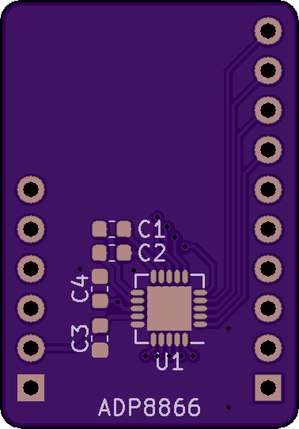
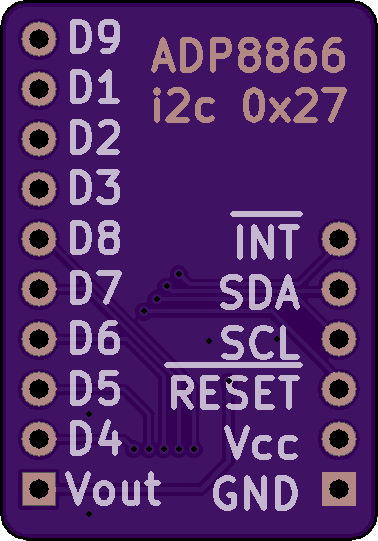

# ADP8866-Breakout

A breakout board for Analog Devices' ADP8866 LED PMIC.

KiCAD project is in the KiCAD directory.

Datasheet and schematic are in the doc directory.

Arduino library is in the Arduino directory, and has been tested with Teensyduino on a version 3.1 Teensy.

------------------------

#### What is in this repository:

**./doc**:  Location for documentation

**./KiCAD**:  Hardware design files

**./Arduino**:  Arduino driver

------------------------

Front | Back
:-------:|:------:
 | 

[#### Order from Tindie](<a href="https://www.tindie.com/products/17866/">)
